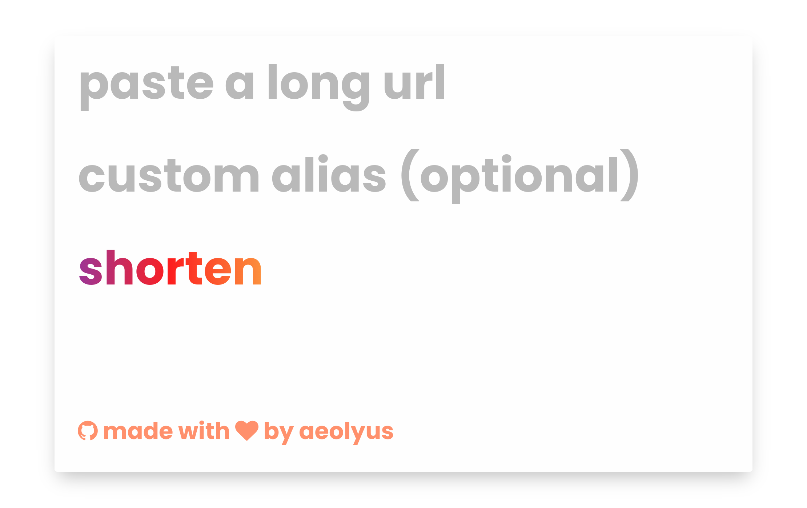

<!--
N.B.: Diese README wurde automatisch von <https://github.com/YunoHost/apps/tree/master/tools/readme_generator> generiert.
Sie darf NICHT von Hand bearbeitet werden.
-->

# Gull für YunoHost

[](https://ci-apps.yunohost.org/ci/apps/gull/)


[](https://install-app.yunohost.org/?app=gull)

*[Dieses README in anderen Sprachen lesen.](./ALL_README.md)*

> *Mit diesem Paket können Sie Gull schnell und einfach auf einem YunoHost-Server installieren.*  
> *Wenn Sie YunoHost nicht haben, lesen Sie bitte [die Anleitung](https://yunohost.org/install), um zu erfahren, wie Sie es installieren.*

## Übersicht

Galène is a videoconference server (an “SFU”) that is easy to deploy and that requires moderate server resources. It was originally designed for lectures and conferences (where a single speaker streams audio and video to hundreds or thousands of users), but later evolved to be useful for student practicals (where users are divided into many small groups), and meetings (where a dozen users interact with each other).

### Client features:

- multiparty audio and video
- text chat
- reasonably good support for mobile (Android and iPhone/iPad)
- screen and window sharing, including sharing multiple windows simultaneously (not on mobile)
- streaming video and audio from disk
- activity detection
- LDAP support
- invite user
- Command-line client for Galene file transfer


**Ausgelieferte Version:** 1.0~ynh1

**Demo:** <https://s.aeoly.us/>

## Bildschirmfotos



## Dokumentation und Ressourcen

- Offizielle Website der App: <https://s.aeoly.us/>
- Upstream App Repository: <https://github.com/aeolyus/gull>
- YunoHost-Shop: <https://apps.yunohost.org/app/gull>
- Einen Fehler melden: <https://github.com/YunoHost-Apps/gull_ynh/issues>

## Entwicklerinformationen

Bitte senden Sie Ihren Pull-Request an den [`testing` branch](https://github.com/YunoHost-Apps/gull_ynh/tree/testing).

Um den `testing` Branch auszuprobieren, gehen Sie bitte wie folgt vor:

```bash
sudo yunohost app install https://github.com/YunoHost-Apps/gull_ynh/tree/testing --debug
oder
sudo yunohost app upgrade gull -u https://github.com/YunoHost-Apps/gull_ynh/tree/testing --debug
```

**Weitere Informationen zur App-Paketierung:** <https://yunohost.org/packaging_apps>
